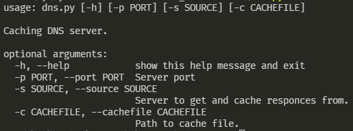
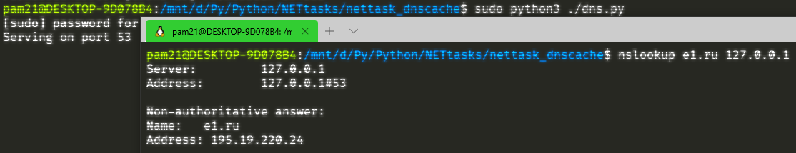
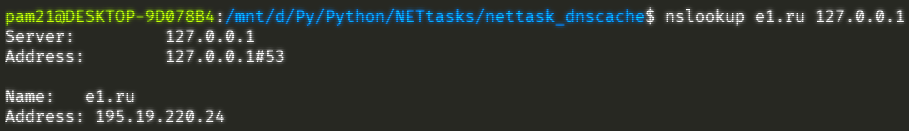
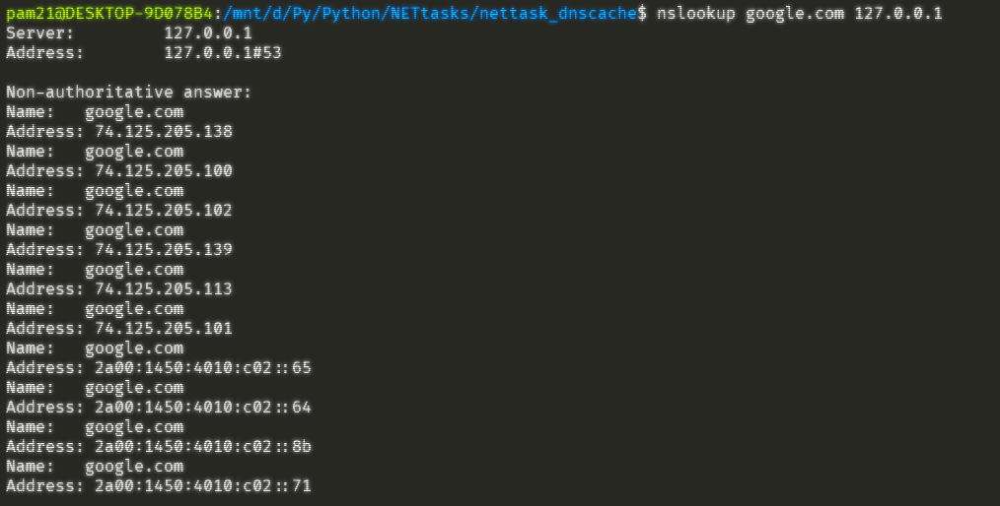
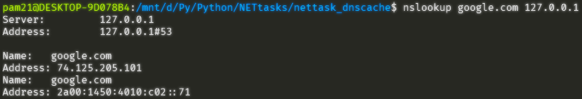
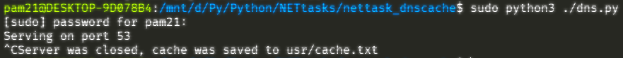

# Caching DNS Server

# Использование

`python ./dns.py` - запускает DNS сервер на порте 53.

`python ./dns.py -h` - получить справку по программе и аргументы запуска.

# Примеры использования:
Справка программы:

Запрос до кэширования:

Запрос после кэширования:

Ещё пример:

После закрытия сервер сохраняет кэш:
